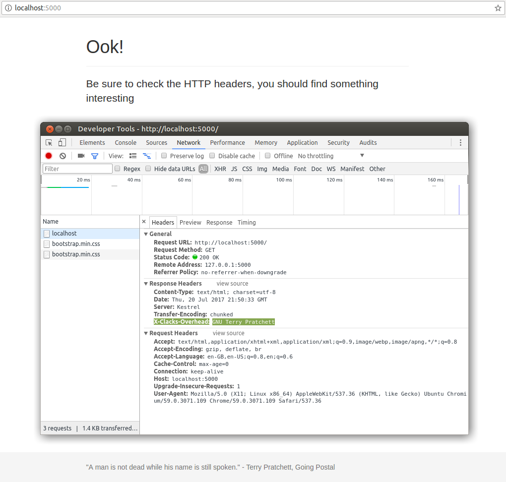

## ClacksMiddleware

ClacksMiddleware is an ASP.NET Core middlware class which will inject the GNU Terry Pratchett HTTP header into all responses.

## Build Status

### Licence

## Code of Conduct
ClacksMiddleware has a Code of Conduct which all contributors, maintainers and forkers must adhere to. When contributing, maintaining, forking or in any other way changing the code presented in this repository, all users must agree to this Code of Conduct.

See [Code of Conduct.md](Code-of-Conduct.md) for details.

## Usage

### TL;DR

See: The code in ClacksMiddlwareExample directory for a worked example

### Long Form

Install the latest version of the [NuGet package](https://www.nuget.org/packages/ClacksMiddlware/) into an ASP.NET Core application.

Add a reference to the ClacksMiddleware namespace in the Startup class:

    using ClacksMiddleware;

Add the middleware to the ASP.NET Core middleware pipeline (the middleware class is called `GnuTerryPratchett`. Example:

    public void Configure(IApplicationBuilder app, IHostingEnvironment env, ILoggerFactory loggerFactory)
    {
      loggerFactory.AddConsole(Configuration.GetSection("Logging"));
      loggerFactory.AddDebug();

      // Add our middlware before any others. Otherwise it may
      // not affect the response for the incoming request
      app.UseMiddleware<GnuTerryPratchett>();

      app.UseMvc();
    }

Request a page within the application, and check the response headers:

